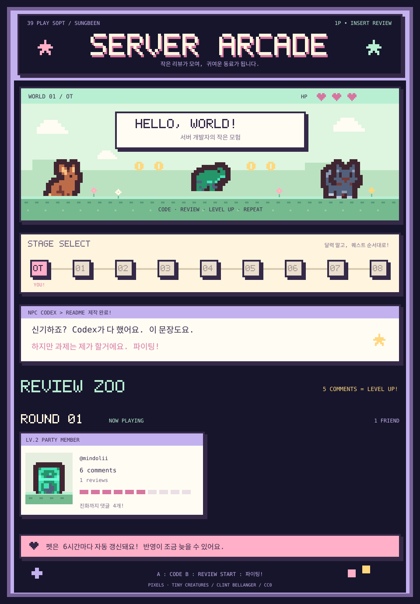

<!-- REVIEW-ZOO:START -->

**현재 퀘스트:** OT · **활동 조:** Round 1  
진화 규칙: inline review comment **0–4개 LV1 · 5–9개 LV2 · 10개 이상 LV3**. 리뷰만 남겨도 LV1 동료로 합류합니다.

세이브 데이터 · 라운드별 리뷰 기록

### Round 1 · 진행 중

| 동료 | 레벨 | Inline comments | Reviews |
| --- | --- | --- | --- |
| [@mindolii](https://github.com/mindolii) | LV2 | 6 | 1 |

집계 데이터 확인 시각(변경 시 저장): 2026-10-10T12:43:37.600Z

<!-- REVIEW-ZOO:END -->

### 👾 BONUS STAGE · 토큰 먹는 동료

토큰 먹는 제 친구를 소개합니다!

이 Mac에서 매일 오전 4시 자동 동기화 · [연동 및 관리 안내](docs/review-zoo.md#tokenphage-토큰-먹는-동료)

게임 설명서 · 제작 크레딧

리뷰를 남기면 제 README에 동료로 등록됩니다. Inline 댓글 5개마다 펫이 진화해요.
라운드가 바뀌면 새로운 파티로 출발하고, 이전 파티는 기록에 남습니다.

- **PLAYER** Sungbeen · 서버 개발 퀘스트 수행 중
- **EQUIPMENT** Codex · 프롬프트 숙련도 상승 중
- **CRAFTING** README: Codex / 과제: Human / 응원: 모두
- **PIXEL ART** [Tiny Creatures — Clint Bellanger](https://opengameart.org/content/tiny-creatures), CC0
- [세팅·자동화·집계 규칙](docs/review-zoo.md) · [리소스 라이선스](assets/review-zoo/CREDITS.md)

